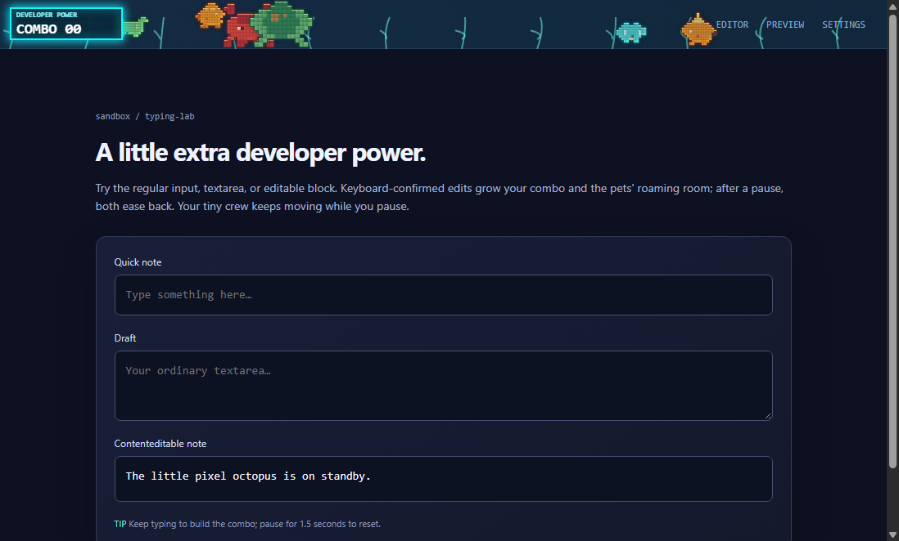
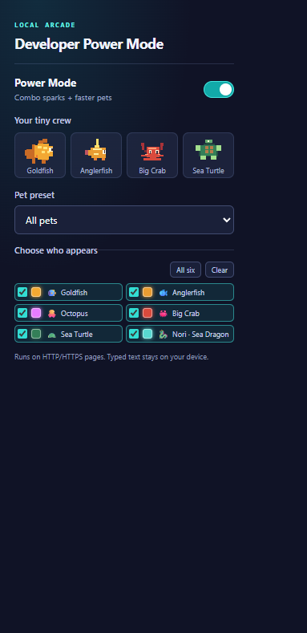
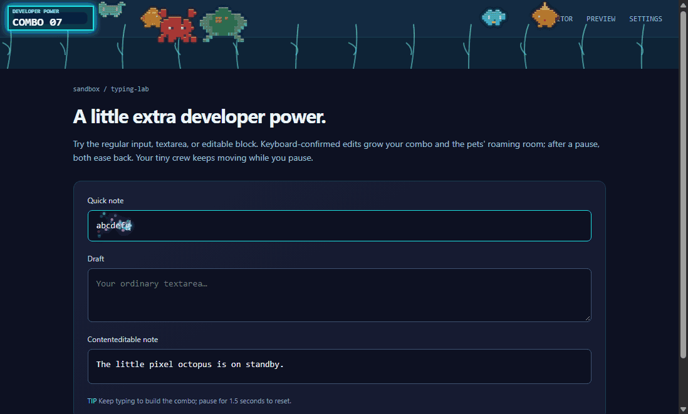

# Developer Power Mode Combo

A local-only Chrome Manifest V3 extension that turns confirmed keyboard edits into a combo counter and fills the page's top edge with original pixel-art pets.







The captures above use `docs/demo.html`, a local workbench that runs the same overlay runtime as the content script. Its first pet lineup is seeded for a clear preview; pets remain random in normal use.

## Install unpacked

1. Download or clone this folder. No package install or build step is needed to run the extension.
2. In Chrome, open `chrome://extensions` and turn on **Developer mode**.
3. Select **Load unpacked** and choose this project folder (the folder containing `manifest.json`).
4. Visit a permitted HTTP or HTTPS webpage and use the extension button to adjust **Power Mode**, choose a **Pet preset**, or customize the individual **pet roster**.

To try the visual preview without installing the extension, serve the project folder from localhost and open `/docs/demo.html`.

The extension asks only for local storage and runs its content script on HTTP/HTTPS matches. It has no background worker, network requests, backend, API keys, or publishing requirement. Preferences are stored with `chrome.storage.local`.

## What it does

- Counts trusted keyboard-driven text edits in ordinary text inputs, textareas, and standard `contenteditable` elements. Password fields, shortcuts, paste, unpaired/programmatic input events, and navigation keys do not count. IME composition commits are counted once.
- Resets the combo after 1.5 seconds without a confirmed edit or when focus changes to another editor.
- Shows a neon arcade counter, caret-adjacent sparks at each third hit, and a brief canvas-only shake every ten hits.
- Animates up to six original pixel-art companions while you type or leave the page idle: Goldfish, Anglerfish, Octopus, Big Crab, Sea Turtle, and Nori the Sea Dragon. Choose a preset or individually select your crew in the popup; your chosen roster is stored locally. Goldfish has a rounded golden body, flowing split tail, swept dorsal and lower fins, and a clear eye; Nori has a long teal body, raised crested head, and flowing fins inspired by the provided sea-dragon image. Sea Turtle has a horizontal swimming profile, domed segmented shell, distinct green head, pale underside, and animated paddle-shaped flippers inspired by the provided turtle image; Big Crab has a larger sprite. Octopuses swim, wiggle their tentacles, and release drifting, fading ink. Selecting an Octopus or the Sea Dragon adds translucent water and swaying seaweed.
- Pets move faster as the typing combo grows: movement gains 6% per confirmed edit up to 2.5x base speed. A combo reset returns them to their regular pace.
- The pet roaming area expands smoothly from the top 60 pixels with each combo hit, reaching the full visible webpage at 60 hits. After the combo resets, the area gradually contracts back to 60 pixels, and pets stay within its changing bounds.
- Once the roaming area grows beyond 70% of the visible page, a school of up to 200 small pixel fish streams in from the upper-left and follows the mouse cursor. The school is active only when pets are enabled and disappears as the roaming area contracts to 70% or less.
- Keeps ambient scenery within a roaming area that starts at the webpage's top 60 pixels and grows with the combo, then eases back after a reset. Above one-third of the visible page height, the original pixel whale and a spotted whale shark swim in with animated splashes. Above one-half page height, a larger blue whale joins the group; each visitor leaves as the area contracts below its threshold. The click-through overlay never covers Chrome's tab bar and does not intercept page interactions.
- Caps its animation at about 30 rendered frames per second, pauses while the page is hidden, and honors reduced-motion preferences with a static counter only.
- Keeps all typed content in the webpage. The extension does not save, log, or transmit it.

The extension is intended for permitted HTTP/HTTPS webpages. It does not run on restricted Chrome pages (such as `chrome://` pages), and it does not promise compatibility with every custom editor or editor framework.

## Test

Node.js 18 or newer is required for the focused test suite:

```sh
npm test
```

The tests cover confirmed-edit eligibility and composition, combo resets, selectable-pet preference persistence, combo-driven pet acceleration, the cursor-following fish school's threshold and activity cap, reduced motion, idle pet animation, frame limiting, and hidden-page pausing.
